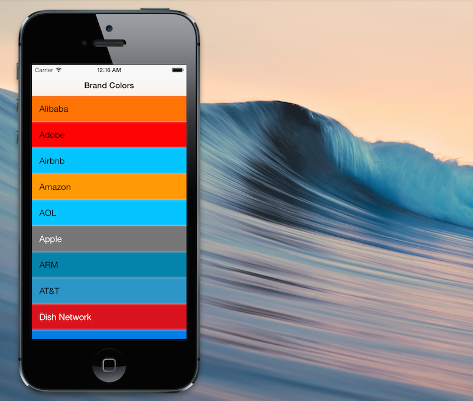

BrandColors
===========

UIColor Category for Brand Colors



# Installation
- Add the files in the BrandColors folder to your project.
- `#import "UIColor+BrandColors.h"`

# Usage

## Objective-C
``` objc
UIButton *facebookButton = [[UIButton alloc] init];
facebookButton.backgroundColor = [UIColor bc_colorForBrand:@"Facebook"]; 

NSLog(@"BrandColors contains %@ brands:%@", @([UIColor bc_brands].count),[UIColor bc_brands]);

if ([[UIColor bc_brandsWithLightColor] containsObject:brand]) {
	cell.textLabel.textColor = [UIColor blackColor];    
}
else {
    cell.textLabel.textColor = [UIColor whiteColor];
}
```

If a brand is not in Brand Colors, the default color returned is `[UIColor clearColor]`
```
#define BC_DEFAULT_COLOR [UIColor clearColor]
```

`bc_colorForBrand:` attemps to match brands

``` objc
UIColor *facebookColor;
// facebook or Facebook will work
facebookColor = [UIColor bc_colorForBrand:@"Facebook"]; 
facebookColor = [UIColor bc_colorForBrand:@"facebook"]; 

UIColor *yahooColor;
yahooColor = [UIColor bc_colorForBrand:@"yahoo"]; 
yahooColor = [UIColor bc_colorForBrand:@"Yahoo"]; 
yahooColor = [UIColor bc_colorForBrand:@"Yahoo!"]; 
```

## Swift
``` swift
var facebookButton = UIButton()
facebookButton.backgroundColor = UIColor.bc_colorForBrand("Facebook")

println("BrandColors contains \(UIColor.bc_brands().count) brands: \(UIColor.bc_brands())")

let lightColorBrands:String[] = UIColor.bc_brandsWithLightColor() as String[]
if ( contains(lightColorBrands,brand) ) {
  cell.textColor = UIColor.blackColor()
}  
else {
  cell.textColor = UIColor.whiteColor()
}
```

# Demo
BrandColors includes two sample projects, one written in Objective-C and one written in Swift.

# List of Brands
```
2014-07-28 13:12:34.773 Demo[96007:8832227] BrandColors contains 91 brands:(
    Acer,
    Alibaba,
    Adobe,
    Airbnb,
    Amazon,
    AOL,
    Apple,
    ARM,
    "AT&T",
    BBC,
    Beats,
    Blizzard,
    Box,
    Broadcom,
    BT,
    BuzzFeed,
    "China Mobile",
    Cisco,
    Corning,
    Dell,
    DirecTV,
    "Dish Network",
    Dropbox,
    eBay,
    Ericsson,
    Evernote,
    Expedia,
    Facebook,
    FedEx,
    Fitbit,
    Flipkart,
    Foursquare,
    Foxconn,
    "General Electric",
    Google,
    GoPro,
    HP,
    HTC,
    Huawei,
    IBM,
    iHeartRadio,
    Instagram,
    Intel,
    LG,
    LinkedIn,
    LINE,
    Lyft,
    Microsoft,
    Motorola,
    Mozilla,
    Netflix,
    Nest,
    Nintendo,
    Nokia,
    "NTT DoCoMo",
    NVIDIA,
    Opera,
    Panasonic,
    PayPal,
    Qualcomm,
    Rovio,
    Rdio,
    Samsung,
    Shazam,
    Skype,
    Snapchat,
    Spotify,
    Sprint,
    SoftBank,
    SoundCloud,
    Starbucks,
    Staples,
    "T-Mobile",
    Tumblr,
    Twitch,
    Twitter,
    Uber,
    Verizon,
    Vimeo,
    Vine,
    Vodafone,
    VSCO,
    Walmart,
    WeChat,
    WhatsApp,
    Wordpress,
    Xiaomi,
    "Yahoo!",
    Yelp,
    YouTube,
    ZTE
) 
```

# Credits
Thanks to [Galen Gidman](https://github.com/galengidman)'s http://brandcolors.net

# Contact
- GitHub: [@dkhamsing](https://github.com/dkhamsing)
- Twitter: [@dkhamsing](https://twitter.com/dkhamsing)
- [Send a Message](http://dkhamsing.tumblr.com/ask)

# License
BrandColors is available under the MIT license. See the [LICENSE](LICENSE) file for more info.
